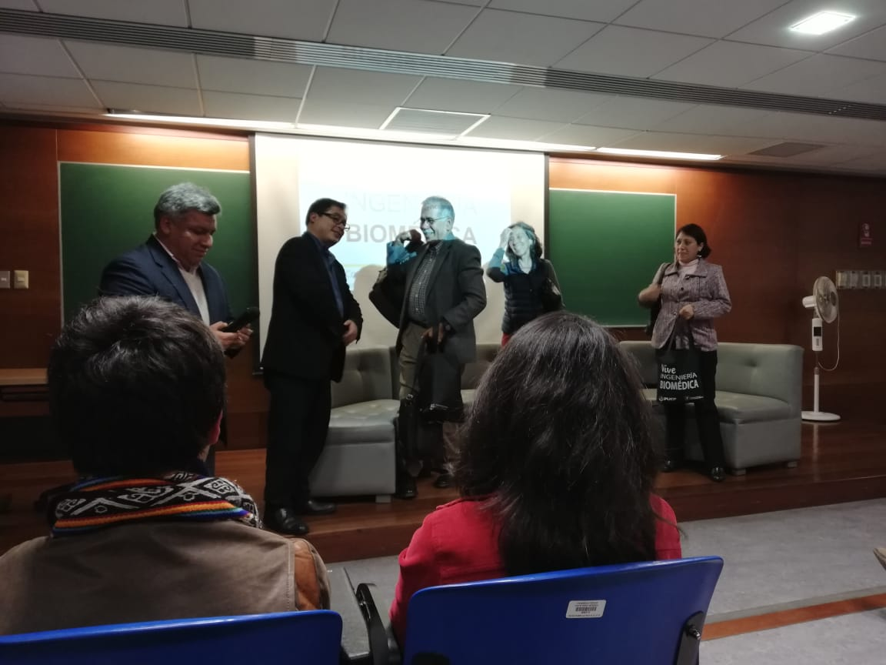
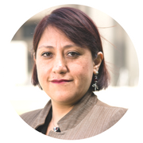
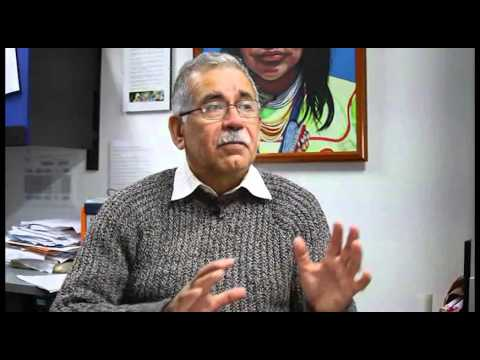
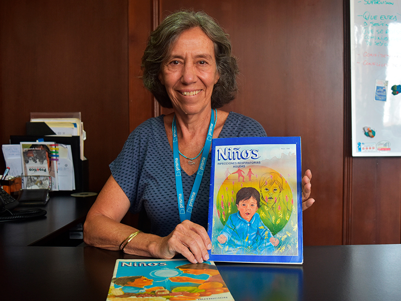

# Conferencia con Expertos sobre Anemia

El día sábado 22 de setiembre, la Universidad Peruana Cayetano Heredia tuvo el placer de tener como invitados a tres profesionales de la salud, quienes respondieron las dudas que tenían los alumnos de la carrera de Ingeniería Biomédica.

La novedosa carrera de Ingeniería Biomédica tiene el curso Gerenciando Procesos de Innovación dentro de su malla curricular, el cual está dirigido por los profesores Luis Peña y Pablo Moreno. Ambos docentes utilizaron diferentes medios para que los alumnos puedan tener un conversatorio con tres especialistas en el tema de Anemia y de este modo concluir con una actividad pendiente dentro del curso.

La primera en presentarse fue María Marull Espinoza, jefa de la carrera de Nutrición de la Universidad Peruana Cayetano Heredia y Candidata a Doctora en Gobierno y Política Pública, quien nos expuso acerca de la anemia en los niños y de la importancia de una  educación nutricional transversal y diversificación de la dieta. En el desarrollo de su exposición comentó que el Estado frente a esta problemática tiene como solución la fortificación de los alimentos tales como harina y arroz; además la suplementación a través de gotas, jarabes y pastillas suelen ser las más recurridas. Explicó también, que nuestro país tiene la necesidad de encontrar nuevos métodos de diagnóstico para la anemia de manera que sea eficaz y confiable, ya que el Hemocue mide niveles de hemoglobina; sin embargo existen otras hormonas más confiables, por ejemplo, la ferritina y hepcidina, aunque cabe resaltar que requiere un costo adicional, inclusive mayor salubridad y cuidado al momento del análisis. Como parte final de su exposición, María Marull recomendó, principalmente para las madres, que es vital el tener una dieta balanceada que contenga alimentos constructores de origen animal; frutas, verduras, tubérculos y grasas naturales.

El siguiente ponente fue  Mario Tavera, Oficial de Salud del Fondo de las Naciones Unidas para la Infancia (UNICEF), quien mencionó que nuestro país es el cuarto en el mundo con más anemia en Sudamérica, lo cual nos revela la crítica realidad que tienen nuestros niños peruanos. Adicionalmente, reveló que existe error en el diagnóstico, ya que aún existe personal médico no capacitado en un correcto análisis de hemoglobina, tal como pasa en los lugares con alturas de nuestro país, donde se realiza el denominado “ajuste por altura”.

Para Mario Tavera debería haber una disponibilidad de alimentos ricos en hierro, tal como la sangrecita donde expresó que en lugares como Sechura-Piura la conservan para su venta y comercio. Incluso detalló la poca participación por parte del Estado, donde no hay mucho seguimiento ni adherencia al plan que viene desarrollando, para lo cual sugiere que esto se mejore o cambie.

Como última expositora fue presentada Delia Haustein, graduada de UPCH como médico cirujano y de Hadassah School of Public Health con grado de maestría en salud pública y directora de PRISMA, explicó acerca del proyecto que ha venido desarrollando desde hace varios años con niños con anemia y desnutrición. Su presencia fue importante porque expuso la efectividad y cuidado de sus proyectos, los cuales contribuyeron y contribuyen a la disminución de casos de estos niños peruanos, ella revela que lo que más se necesita es apoyo y coordinación de los encargados; por otra parte mencionó la importancia de las visitas domiciliarias, investigación formativa, comunicación personal o grupal.

Finalmente, el conversatorio concluyó con una serie de preguntas por parte de los alumnos, los cuales estuvieron agradecidos con los profesores por la oportunidad brindada de interactuar con los especialistas en el tema.

